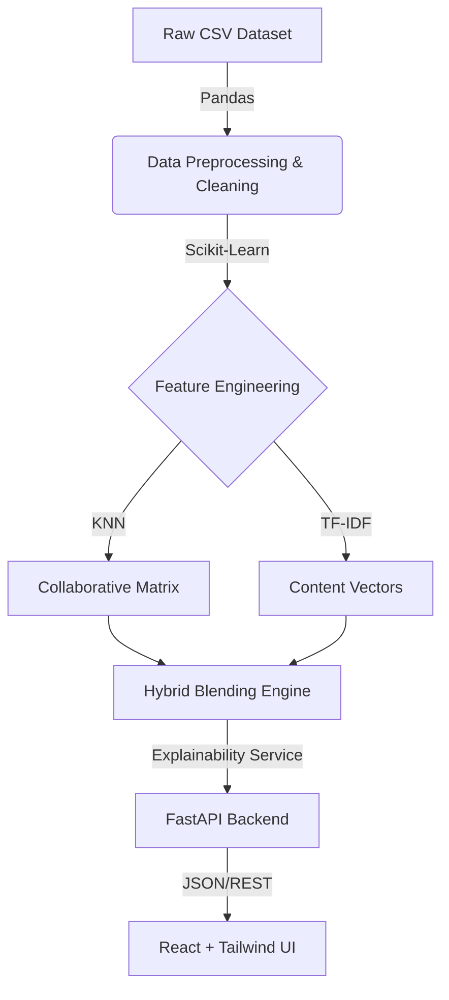

<div align="center">
  <br />

  # 📚 Book-Recommendation-Engine-using-KNN
  <strong>An Elite, Python-First Machine Learning Recommendation Engine</strong>

  <p>
    <a href="#about">About</a> •
    <a href="#features">Features</a> •
    <a href="#architecture">Architecture</a> •
    <a href="#installation">Installation</a> •
    <a href="#how-it-works">How It Works</a>
  </p>

  
  
  
  
  
  
</div>

<br />

## 🌟 About
BookWise AI is an enterprise-grade, full-stack Machine Learning project. It transforms the raw, noisy Book-Crossing dataset into a highly accurate, personalized recommendation system.

Instead of relying on a single algorithm, BookWise AI leverages a **Hybrid Engine**, combining Collaborative Filtering (analyzing reader behavior) with Content-Based Filtering (analyzing book metadata) to completely eliminate the "Cold Start" problem. 

**_Disclaimer:_** *No `.env` secrets, trained models (`.pkl`), or heavy datasets (`.csv`) are exposed in this repository. Ensure you run the data pipeline locally to test it.*

---

## ✨ Features

- **Automated Data Engineering**: Python scripts that auto-download, clean, and map the Book-Crossing dataset into efficient memory structures (`scipy.sparse.csr_matrix`).
- **Hybrid Recommendation Algorithm**: 
  - *Collaborative Filtering (KNN)*: Computes cosine similarities between users to find reading patterns.
  - *Content-Based Filtering (TF-IDF)*: Vectorizes Book Titles, Authors, and Publishers.
- **Explainable AI (XAI)**: The engine doesn't just guess—it explicitly tells you *why* a book was recommended by analyzing the overlapping metadata and interaction vectors.
- **FastAPI Backend**: A lightning-fast, production-ready Python API that serves pre-computed ML artifacts.
- **Elite Frontend**: A stunning, premium dark-mode interface built with React, Vite, and Tailwind v4, utilizing glassmorphism and smooth micro-animations.

---

## 🏗️ Architecture



---

## 🚀 Installation & Setup

### 1. The Machine Learning Backend
All data processing and model training happens in Python.

```bash
cd backend

# 1. Create and activate a virtual environment
python -m venv venv
.\venv\Scripts\activate      # Windows
# source venv/bin/activate  # Mac/Linux

# 2. Install Dependencies
pip install -r requirements.txt

# 3. Auto-Download Data & Train Models
# This generates the Sparse Matrices and Model Artifacts
python scripts/download_dataset.py
python scripts/train.py

# 4. Start the API Server
uvicorn main:app --reload --port 8000
```
*The backend API will run on `http://localhost:8000`*

### 2. The React Frontend
Open a **second** terminal window.

```bash
cd frontend

# 1. Install Node Dependencies
npm install

# 2. Start the Vite Development Server
npm run dev
```
*The UI will be accessible at `http://localhost:5173`*

---

## 🧠 How It Works (The Math)

1. **Sparsity Handling**: The system calculates the density of the interaction matrix. To avoid massive noise, it strips users who have rated fewer than `X` books and books with fewer than `Y` ratings.
2. **K-Nearest Neighbors**: We utilize unsupervised learning (`NearestNeighbors`) fitted with a `cosine` metric algorithm to find the exact angle of similarity between two books in a multi-dimensional space.
3. **TF-IDF Vectorization**: Text metadata is transformed into numerical vectors. This guarantees that if a book is completely unread (no collaborative history), the engine can still fall back on author and publisher similarities to recommend it.
